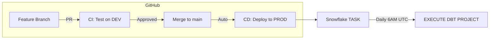
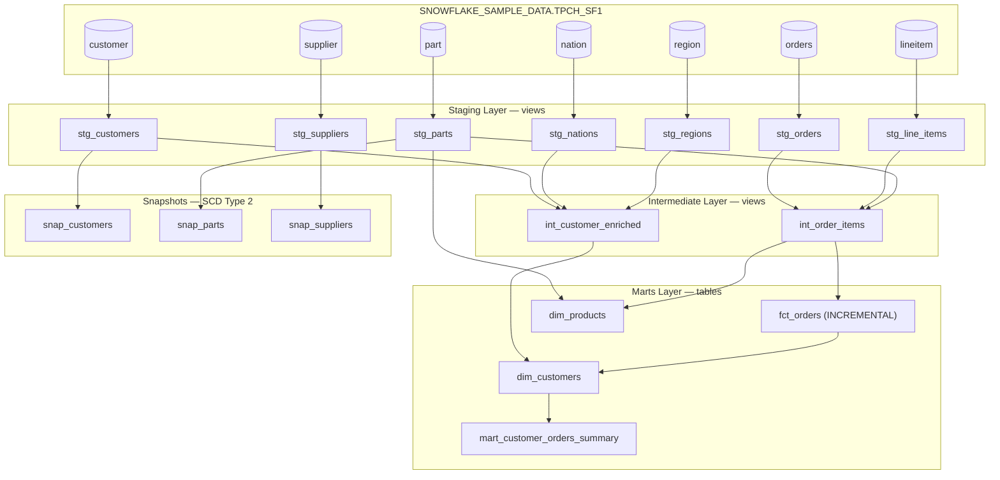

# dbt-snowflake-ecommerce-analytics

A production-grade dbt project on Snowflake, built on the TPC-H benchmark dataset simulating an ecommerce supply chain. Features a layered transformation pipeline with CI/CD automation via GitHub Actions.

---

## Workflow



## Data Pipeline (DAG)



## Project Structure

```
├── dbt_project.yml                 # Project configuration
├── profiles.yml                    # Snowflake connection (dev + prod targets)
├── snowflake.toml                  # Snowflake CLI config for CI/CD
├── .gitignore
├── .github/
│   └── workflows/
│       └── deploy.yml              # CI/CD pipeline
├── models/
│   ├── sources.yml                 # 8 TPC-H source tables
│   ├── staging/                    # 7 models (views) + staging.yml
│   │   ├── stg_customers.sql
│   │   ├── stg_orders.sql
│   │   ├── stg_line_items.sql
│   │   ├── stg_parts.sql
│   │   ├── stg_suppliers.sql
│   │   ├── stg_nations.sql
│   │   └── stg_regions.sql
│   ├── intermediate/               # 2 models (views) + intermediate.yml
│   │   ├── int_order_items.sql
│   │   └── int_customer_enriched.sql
│   └── marts/                      # 4 models (tables) + marts.yml
│       ├── fct_orders.sql          # INCREMENTAL
│       ├── dim_customers.sql
│       ├── dim_products.sql
│       └── mart_customer_orders_summary.sql
├── macros/
│   ├── calculate_return_rate.sql
│   ├── format_currency.sql
│   └── format_count.sql
└── snapshots/
    ├── snap_customers.sql
    ├── snap_parts.sql
    └── snap_suppliers.sql
```

## Features

| Feature | Details |
|---------|---------|
| **Layered architecture** | Sources → Staging (views) → Intermediate (views) → Marts (tables) |
| **79 data tests** | unique, not_null, accepted_values, relationships |
| **Incremental model** | `fct_orders` uses merge strategy — only processes new orders |
| **SCD Type 2 snapshots** | Track historical changes to customers, parts, suppliers |
| **Custom macros** | `calculate_return_rate`, `format_currency`, `format_count` |
| **Model tags** | `customer`, `order`, `product`, `supplier`, `geo` for selective runs |
| **Full documentation** | Descriptions on all models and columns |
| **Multi-environment** | `dev` (DEV_ANALYTICS) and `prod` (ANALYTICS) targets |
| **CI/CD** | GitHub Actions — auto-test on PR, auto-deploy on merge |
| **Scheduled execution** | Snowflake TASK runs daily at 6 AM UTC |

## Environments

| Environment | Schema | Trigger |
|-------------|--------|---------|
| **Dev** | `ECOMMERCE_DB.DEV_ANALYTICS` | `dbt run` (default target) |
| **CI** | `ECOMMERCE_DB.DEV_ANALYTICS` | Automatic on Pull Request |
| **Prod** | `ECOMMERCE_DB.ANALYTICS` | Automatic on merge to `main` |

## CI/CD Workflow

```
Developer makes changes
        │
        ▼
Push to feature branch → Open Pull Request
        │
        ▼
┌───────────────────────────────┐
│  CI Job (GitHub Actions)      │
│  - Deploy temp dbt project    │
│  - dbt run (dev schema)       │
│  - dbt test                   │
│  - Drop temp project          │
└───────────────┬───────────────┘
                │ All tests pass
                ▼
        PR Approved + Merged
                │
                ▼
┌───────────────────────────────┐
│  CD Job (GitHub Actions)      │
│  - Deploy dbt project (prod)  │
│  - Ensure TASK is active      │
└───────────────┬───────────────┘
                │
                ▼
     TASK runs daily @ 6 AM UTC
     (dbt run against prod)
```

## Commands

```bash
# Development
dbt run                                    # Run all models (dev)
dbt run --select tag:customer              # Run customer models only
dbt test                                   # Run all 79 tests
dbt run --full-refresh --select fct_orders # Rebuild incremental model
dbt snapshot                               # Capture SCD snapshots
dbt docs generate                          # Generate documentation
dbt docs serve                             # View docs + DAG locally (localhost:8080)

# Production (via SQL)
EXECUTE DBT PROJECT ECOMMERCE_DB.ANALYTICS.ECOMMERCE_PIPELINE ARGS = 'run';
EXECUTE DBT PROJECT ECOMMERCE_DB.ANALYTICS.ECOMMERCE_PIPELINE ARGS = 'test';
EXECUTE DBT PROJECT ECOMMERCE_DB.ANALYTICS.ECOMMERCE_PIPELINE ARGS = 'docs generate';
```

## Scheduling

The pipeline runs automatically via a Snowflake TASK:

| Property | Value |
|----------|-------|
| **Task name** | `ECOMMERCE_DB.ANALYTICS.RUN_DBT_DAILY` |
| **Schedule** | Daily at 6:00 AM UTC |
| **Cron expression** | `0 6 * * *` |
| **Warehouse** | `COMPUTE_WH` (X-Small) |
| **What it runs** | `EXECUTE DBT PROJECT ECOMMERCE_DB.ANALYTICS.ECOMMERCE_PIPELINE ARGS = 'run'` |
| **Auto-created by** | CD pipeline on every merge to `main` |

### Manage the Schedule

```sql
-- Check task status
SHOW TASKS IN SCHEMA ECOMMERCE_DB.ANALYTICS;

-- View execution history
SELECT * FROM TABLE(INFORMATION_SCHEMA.TASK_HISTORY())
WHERE NAME = 'RUN_DBT_DAILY'
ORDER BY SCHEDULED_TIME DESC
LIMIT 10;

-- Pause the schedule
ALTER TASK ECOMMERCE_DB.ANALYTICS.RUN_DBT_DAILY SUSPEND;

-- Resume the schedule
ALTER TASK ECOMMERCE_DB.ANALYTICS.RUN_DBT_DAILY RESUME;

-- Change schedule (e.g., every 6 hours)
ALTER TASK ECOMMERCE_DB.ANALYTICS.RUN_DBT_DAILY
  SET SCHEDULE = 'USING CRON 0 */6 * * * UTC';

-- Run manually (outside schedule)
EXECUTE TASK ECOMMERCE_DB.ANALYTICS.RUN_DBT_DAILY;
```

## Documentation & DAG

To view the interactive documentation site with lineage DAG:

```bash
# Option 1: Local (after cloning)
git clone https://github.com/Krishna9181/dbt-snowflake-ecommerce-analytics.git
cd dbt-snowflake-ecommerce-analytics
dbt docs generate
dbt docs serve       # Opens at http://localhost:8080

# Option 2: Via deployed project (SQL)
EXECUTE DBT PROJECT ECOMMERCE_DB.ANALYTICS.ECOMMERCE_PIPELINE ARGS = 'docs generate';
```

The docs site includes:
- **Interactive DAG** — visual graph of all model dependencies
- **Model details** — descriptions, columns, tests, SQL
- **Source definitions** — all 8 TPCH tables
- **Test coverage** — 79 tests across all layers

## Source Data

Built on `SNOWFLAKE_SAMPLE_DATA.TPCH_SF1` — a TPC-H benchmark dataset simulating a global supply chain:

| Table | Rows | Description |
|-------|------|-------------|
| CUSTOMER | 150K | Customer demographics and market segments |
| ORDERS | 1.5M | Order headers (1992-1998) |
| LINEITEM | 6M | Order line items with pricing and shipping |
| PART | 200K | Product catalog |
| SUPPLIER | 10K | Supplier directory |
| PARTSUPP | 800K | Part-supplier relationships |
| NATION | 25 | Country reference (25 nations) |
| REGION | 5 | Geographic regions (5 regions) |

## Setup

### Prerequisites
- Snowflake account with ACCOUNTADMIN role
- GitHub repository

### GitHub Secrets Required
| Secret | Description |
|--------|-------------|
| `SNOWFLAKE_ACCOUNT` | Snowflake account identifier (org-account format) |
| `SNOWFLAKE_USER` | Snowflake username |
| `SNOWFLAKE_PASSWORD` | Snowflake password |

### Local Development
```bash
git clone https://github.com/Krishna9181/dbt-snowflake-ecommerce-analytics.git
cd dbt-snowflake-ecommerce-analytics
dbt deps
dbt run --target dev
dbt test
```
